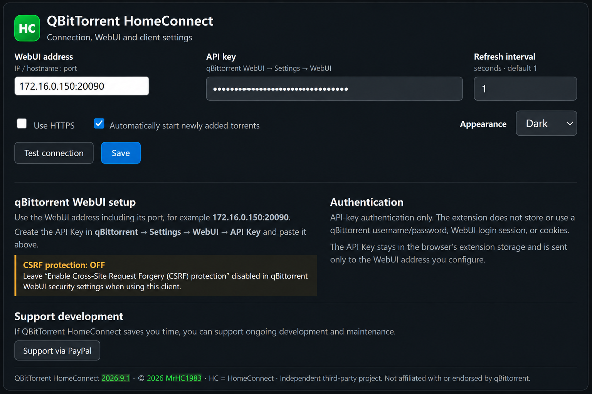

# QBitTorrent HomeConnect 2026.9.1

An independently written Chromium browser extension for managing qBittorrent through its WebAPI.

## Features

- qBittorrent API-key (Bearer) authentication only
- Torrent list with progress, status, seeds/peers, speeds and ETA
- Select one or more torrents for Start, Stop and Remove
- Torrent detail panel with piece-by-piece download progress
- Add `.torrent` files and torrent URLs/magnets
- Optional automatic start for newly added torrents
- Right-click actions when the browser permits extension context menus
- Direct link to the qBittorrent WebUI
- Free disk space and aggregate transfer speeds in the bottom status bar
- No cloud backup, telemetry, external scripts or qBittorrent username/password login

## Screenshots

### Main torrent view

### Settings

## Compatibility

Designed for qBittorrent 5.2+ and Chromium MV3 browsers such as Microsoft Edge and Google Chrome.

## qBittorrent setup

Enable API-key authentication in qBittorrent WebUI and enter the WebUI address and API key in the extension settings. If an API request is rejected with HTTP 401/403 while the API key itself is known to be correct, check qBittorrent WebUI CSRF/origin protection settings.

## Privacy

The extension communicates directly with the qBittorrent WebAPI address configured by the user. The API key is stored in browser extension storage and is sent only to that configured WebAPI endpoint. No analytics or telemetry service is used.

## Support development

If QBitTorrent HomeConnect saves you time, voluntary support for ongoing development and maintenance is welcome:

**PayPal:** https://paypal.me/MrHC1983

## Copyright

Copyright © 2026 MrHC1983. Licensed under the MIT License.

## Disclaimer

QBitTorrent HomeConnect is an independent third-party project. It is not affiliated with, endorsed by, or an official product of the qBittorrent project.